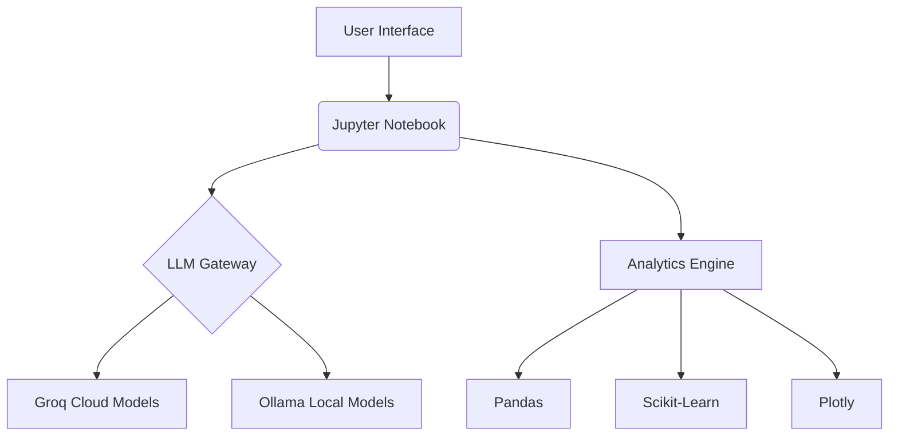

# 🚀 Telecom Customer Analytics Platform


Advanced analytics solution for telecom providers featuring natural language processing, predictive modeling, and interactive visualizations.

## ✨ Key Features

- **Multi-LLM Architecture**: Choose between cloud (Groq) and local (Ollama) models
- **Smart Q&A System**: Natural language queries in Persian/English
- **Auto-Visualization**: AI-generated charts from insights
- **Churn Prediction**: Machine learning-powered forecasting
- **Responsive Dashboard**: Mobile-friendly UI with RTL support
- **Dockerized**: One-command deployment

## 🛠️ System Architecture



## 🐳 Docker Deployment

### Prerequisites
- Docker Engine 20.10+
- Ollama running on host
- (Optional) Groq API key

### Setup
```bash
# Clone repository
git clone https://github.com/yourusername/telecom-analytics.git
cd telecom-analytics

# Build Docker image
docker build -t telecom-analytics .

# Run container (Linux/Mac)
docker run -d --name telecom-app \
  -p 8888:8888 \
  -v ./telco:/work \
  --add-host=host.docker.internal:host-gateway \
  telecom-analytics

# Run container (Windows PowerShell)
docker run -d --name telecom-app `
  -p 8888:8888 `
  -v ${PWD}/telco:/work `
  --add-host=host.docker.internal:host-gateway `
  telecom-analytics
```

### Ollama Setup
```bash
# Start Ollama service
ollama serve

# Download models
ollama pull tinyllama
ollama pull qwen2:0.5b
ollama pull qwen2:1.5b
```

## 🔑 Usage
1. Access Jupyter Lab at `http://localhost:8888/lab?token=<your-token>`
2. Open `app.ipynb`
3. Select LLM model from dropdown
4. Enter queries in Persian or English
5. Explore insights and visualizations

## 📊 Supported Models

| Model Name | Type | ID |
|------------|------|----|
| DeepSeek-R1 | Cloud | `deepseek-r1-distill-llama-70b` |
| Llama3-70B | Cloud | `llama3-70b-8192` |
| Mixtral-8x7B | Cloud | `mixtral-8x7b-32768` |
| TinyLLaMA | Local | `tinyllama` |
| Qwen2-0.5B | Local | `qwen2:0.5b` |
| Qwen2-1.5B | Local | `qwen2:1.5b` |

## 🚨 Troubleshooting

### Ollama Connection Issues
```bash
# Verify host-gateway
docker run --rm alpine nslookup host.docker.internal

# Test Ollama connection
docker exec telecom-app curl host.docker.internal:11434
```

### Permission Issues
```bash
# Fix volume permissions
docker run --rm -v ./telco:/work busybox chown -R 1000:1000 /work
```

### Groq API Setup
Add to notebook:
```python
import os
os.environ["GROQ_API_KEY"] = "your_api_key_here"
```

## 📂 Project Structure
```
telecom-analytics/
├── app/
│   ├── app.ipynb          # Main application
│   └── data/
│       └── telecom_churn.csv    # Sample dataset
├── Dockerfile             # Container configuration
├── requirements.txt       # Python dependencies
└── README.md              # Documentation
```

## 📄 License
MIT License - See [LICENSE](LICENSE) for details
